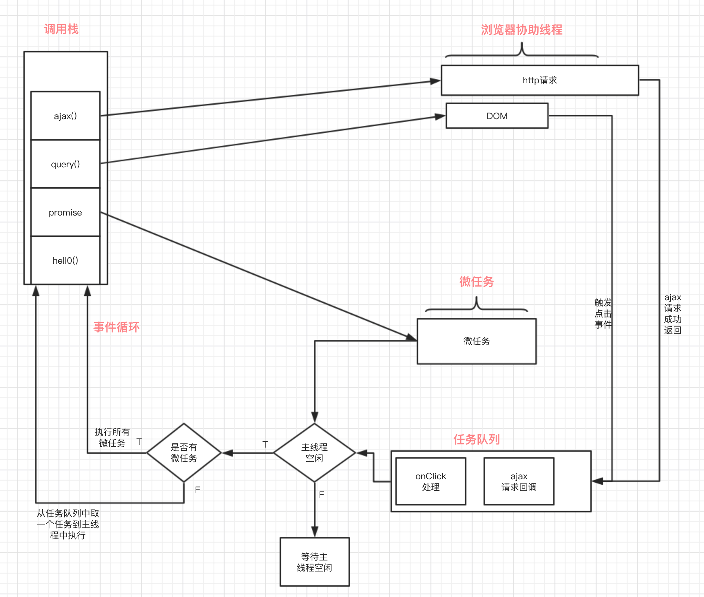

## 关于javascript

javascript是单线程的

**所谓单线程就是程序按照顺序执行， 同一时间内只能执行一个任务， 前面的任务执行完之后， 才能执行后面的任务。**

我们都知道顺序执行， 一旦前面的任务非常耗时， 后面的任务便需要等待， 从而造成页面的卡顿。那么javascript为什么还要被设计成单线程的呢? 

    这主要与javascript的用途有关。javascript是一种浏览器脚本语言， 主要用来进行用户交互， DOM操作等， 试想， 前一个任务修改DOM的属性， 后一个任务要删除这个DOM， 如果JS是多线程的， 两个任务被分配到不同的线程运行， 该以何为主呢， 为了减少复杂性，因此javascript被设计成单线程。

那么如何解决任务超时卡顿的问题呢？

- JS运行在浏览器中， JS是单线程的， 但是浏览器是多线程的
- 在浏览器中存在如下线程

    - **JS引擎线程**

        负责js代码的解析与执行，可称之为主线程
    - **定时器触发线程**

        主要控制计时器setInterval和延时器setTimeout, 用于定时器的计时， 计时完成后， 满足定时器的触发条件时， 则将定时器处理函数推进事件队列中， 等待JS引擎执行
    - **浏览器事件触发线程**

        归属于浏览器内核进程， 不受JS引擎线程控制。主要用于控制事件（如鼠标， 键盘）， 当该事件被触发的时候， 事件出发线程就会把事件的处理函数推进事件队列， 等待JS引擎执行
    - **HTTP请求线程**

        通过XMLHttpRequest连接后， 通过浏览器新开的一个线程， 在监控到readyState状态变更即请求返回时， 如果设置了该状态的回调函数， 则将该状态的处理函数推进事件队列中， 等待JS引擎执行
    - **UI渲染**

## 任务分类

javascript中，可以把执行的一段段代码看成一个个任务，任务又分为两种

- 宏任务

    宏任务又按执行顺序分为：
    - 同步任务
        1. script（整体代码）
        也就是JS引擎在主线程上顺序执行；javascript在执行时首先创建[执行上下文](./执行上下文.md)，放入调用栈中依次执行， 前面的任务执行完后， 才能执行后面的任务
    - 异步任务

        异步任务指的是不直接进入JS主线程， 而是先由其他相关线程处理， 当相关线程处理完毕(或者满足触发条件时)， 相关线程将该异步任务推进任务队列， 等待JS引擎主线程上的任务执行完毕， 空闲后再从任务队列中读取任务执行
        1. 定时器
        2. 网络请求
        3. UI渲染
        4. DOM事件

- 微任务
    - promise
    - process.nexttrick
    - Object.observe

## 任务队列：

- JS在执行过程中， 首先判断是宏任务还是微任务， 
- 如果是微任务如Promise， 就将then回调放到微任务队列中， 
- 如果是宏任务， 判断是同步任务还是异步任务， 
- 如果是异步任务，如setTimeout， http请求等，就将回调函数放到异步队列中， 
- 否则就放到同步队列， 也就是主线程直接执行

**宏任务(同步任务) ----> 微任务 -----> 宏任务(异步任务)**

## 事件循环(Event Loop)

那么JS又是怎么实现这种任务处理的呢， 那就是浏览器的**事件循环**机制

可以将事件循环机制理解为三部分

- 主线程执行栈
- 异步任务执行
- 任务队列（异步任务执行完或者达到执行条件）

引用一张图来理解一下：

在JS引擎执行过程中：
- **首先加载javascript代码， 执行， 形成函数调用栈**
- **当执行栈中的函数遇到微任务时（如： promise）, 会将then方法放置到微任务队列**
- **当执行栈中的函数调用到一些异步执行的任务时（像http请求， DOM事件等）， 会启用浏览器对应的线程进行监控，处理**
- **当异步任务执行完毕， 或者满足触发条件时（如到达定时器指定时间）， 处理该任务的线程会将该任务的执行函数（回调函数）推入到任务队列， 等待执行**
- **当JS引擎主线程上的同步任务执行完毕后**
    - 首先看是否有微任务， 
    - 如果有微任务， 则执行所有的微任务， 微任务执行完毕后， 回到宏任务执行
    - 如果没有微任务， 看任务队列是否为空， 如果任务队列中有任务需要处理， 则取一个任务到主线程中处理。
    - 该轮执行（同步任务 ---> 所有微任务 ---> 一个异步任务）， 完成后， 重新判断主线程是否空闲， 查看是否有微任务， 如此循环下去

## 实例分析

    console.log('script start');

    setTimeout(function() {
        console.log('setTimeout');
    }, 0);
    function getData() {
        $.get('https://www.baidu.com/').then(() => {
            console.log('http');
        })
    }
    Promise.resolve()
    .then(function() {
        console.log('promise1');
    }).then(function() {
        console.log('promise2');
    });

    getData();

    console.log('script end');

结果：

    script start
    script end
    promise1
    promise2
    setTimeout
    http
    
1. 加载javascript代码，顺序运行
2. 遇到console.log, 判断为同步任务， 则直接打印'script start'
3. 遇到setTimeout判断为异步任务， 触发浏览器定时器控制线程， 交给该线程处理，主线程继续向下运行
    - W3C在HTML标准中规定setTimeout低于4ms的时间间隔算为4ms，
    - 当计时到4ms时， 将回调函数推到任务队列中
4. 遇到Promise, 直接执行， 然后将then放到微任务中等待执行
5. 调用函数getData
6. 在函数中遇到http请求， 触发浏览器http请求线程， 交给该线程处理
    - 内部当http请求处理完成， 则将回调函数推到任务队列
7. 遇到console.log, 判断为同步任务， 则直接打印'script end'
8. 主线程空闲
9. 判断有没有微任务， 此时发现有微任务， 则将所有微任务推到主线程中执行， 打印promise1， 打印promise2
10. 微任务执行完毕， 重新回到宏任务，执行同步任务， 此时没有要执行的同步任务， 

    在判断有没有微任务， 此时也没有要执行的微任务， 
    
    然后判断有没有异步任务， 发现有， 就推一个异步任务到主线程中执行

    执行完毕重新回到宏任务， 循环一轮后， 推送第二个异步任务到主线程中执行

## Link
- http://www.ruanyifeng.com/blog/2014/10/event-loop.html
- https://heyingye.github.io/2018/03/19/js%E5%BC%95%E6%93%8E%E7%9A%84%E6%89%A7%E8%A1%8C%E8%BF%87%E7%A8%8B%EF%BC%88%E4%B8%80%EF%BC%89/
