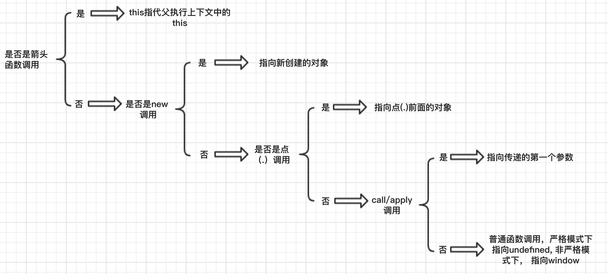

函数的 this 关键字在javascript中是在函数运行期绑定的， this代表的是什么完全取决于函数的调用方式， 函数可以独立运行， 也可以作为对象的方法运行，我们通过函数的运行方式来看一下this的指向

## 作为函数调用
非严格模式下指代的是window：

    var p = 1;
    function fn() {
        var p = 2;
        this.p = 3;
        console.log(this, this.p) 
        function fn2() {
            console.log(this, this.p)
        }
        fn2(); // window 3
    }
    fn(); // window 3
严格模式下指代的是undefined：

    var p = 1;
    function fn() {
        'use strict'
        var p = 2;
        // this.p = 3; 由于严格模式下this指代的是undefined，所以这里不能创建p属性，会报错
        console.log(this, p) // undefined 2 
    }
    fn();
## 作为对象方法调用

    var obj = {
        count: 1,
        getCount: function() {
            console.log(this) // {count: 1, getCount: ƒ}
        },
    }
    obj.getCount();
    function f1() {
        console.log(this.count)
    }
    f1(); // undefined
    obj.f1 = f1;
    obj.f1(); // 1
作为对象方法调用时， this指代的是当前调用该方法的对象

## 在构造函数中调用

    function Fn() {
        this.name = 'a';
    }
    var a = new Fn();
    // a: {name: "a"}
在构造函数中调用的时候， this指代的是新创建的对象

## 使用call或者apply调用

    var obj = {
        name: 'obj',
    }
    function f1() {
        console.log(this.name)
    }
    var obj1 = {
        name: 'obj1',
        f1: function() {
            console.log(this.name)
        }
    }
    f1(); // undefined, 作为函数调用
    obj1.f1(); // 'obj1', 对象方法调用
    f1.call(obj); // 'obj'
    obj1.f1.call(obj); // 'obj'
    [call／apply](./call_apply_bind.md) 会修改函数内部this指向

## 箭头函数中的this调用
- **所有的箭头函数都没有自己的this，函数中的this都指向外层**
- **箭头函数”的this，总是指向定义时所在的对象，而不是运行时所在的对象**
- **箭头函数没有自己的this，arguments，super或 new.target， 不能用作构造函数**
- **箭头函数在使用call／apply/bind的时候会自动忽略第一个参数**

    var obj1 = {
        name: 'obj1',
        f1: () => {
            console.log(this) 
        }
    }
    obj1.f1(); // window
    
是不是很奇怪， 按照上面的例子， 这里的this指向的应该是obj1， 但是使用箭头函数定义的时候，发生了变化， 那么this是何时绑定的呢？

所谓的定义时候绑定，就是this是继承自 **父执行上下文** 中的this，比如这里的箭头函数中的this，箭头函数本身与say组成以key:value的形式，也就是箭头函数本身所在的对象为obj，而obj的父执行上下文就是window，因此这里的this实际上表示的是window

看一下babel是怎么实现箭头函数的编译的

在箭头函数内部没有this引用的时候，默认编译成这样

    var f = (value) => {
        return value
    }
    编译后：
    var f = function f(value) {
        return value;
    };
但是如果箭头函数内部使用了this，就成了
    var obj1 = {
        name: 'obj1',
        f1: () => {
            console.log(this) 
        }
    }
    obj1.f1();
    编译后（使用严格模式）：

    var obj1 = {
        name: 'obj1',
        f1: function f1() {
            console.log(undefined);
        }
    };
    obj1.f1();

函数内部的箭头函数

    function fn() {
        var f = () => {
            console.log(this)
        }
    }
    fn()
    编译后(严格模式下)：
    function fn() {
        var _this = this;

        var f = function f() {
            console.log(_this);
        };
    }
    fn();

