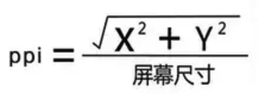
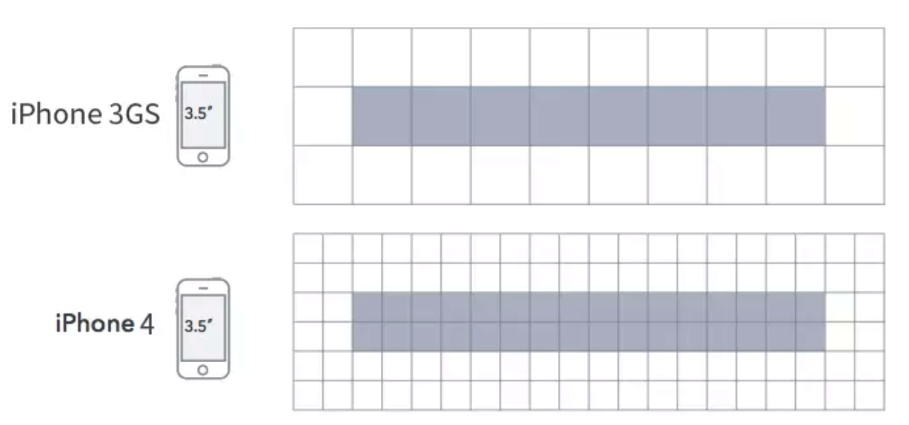

## 基本概念
- inch: 英寸
- px: pixel, 像素， 屏幕上显示数据的最基本的点
- pt: point, 标准长度单位， iOS开发单位
- dp: 安卓开发用的长度单位， 1dp表示在屏幕像素点密度为160ppi时1px长度
- sp: 安卓开发用的字体大小单位
- ppi: 每英寸所拥有的像素数目，屏幕像素密度
- dpi: 每英寸多少点
- dpr: 设备像素比
- rem: rem是相对尺寸单位，相对于html标签字体大小的单位

## 关系
- **1pt = 1/72 英寸**
- **计算机屏幕上 dpi = ppi**
- **ppi: **
- **1pt = (ppi/72) px**
- **1dp = (ppi / 160)px**
- **dpr = 设备像素个数 / 设备宽度（device-width）**
- **1rem = html标签的字体大小(根元素设置的字体大小); **

    例如: html, body{font-size: 14px}; 则1rem = 14px;

## iOS不同设备的像素密度

- @1x，163ppi(iphone3gs）

    （屏幕大小320*480 pt, 屏幕像素320*480 px）

    图片使用1倍图

- @2x，326ppi（iphone4、4s、5、5s、6）, 正好是iphone3gs的两倍

    4/4s: （屏幕大小320*480 pt, 屏幕像素640*960 px, 3.5寸）

    5/5s: （屏幕大小320*560 pt, 屏幕像素640*1136 px, 4寸）

    6／6s/7/8: （屏幕大小375*667 pt, 屏幕像素750*1334 px, 4.7寸）

    显示图片20*20 ， 则设计图片应该是40*40px

- @3x,401ppi（iphone6+）, 是iphone3gs的2.46倍， 在实际屏幕中压缩放置

    6p/6sp/7p/8p: 屏幕大小414*736 pt, 屏幕像素1242*2208px, 4.7寸）

- @3x, 458ppi(iPhoneX), 是iphone3gs的2.8倍

    显示图片20*20 ， 则设计图片应该是60*60px, 3倍，在实际屏幕中压缩放置

## meta

        <meta name="viewport" content="initial-scale=1.0,user-scalable=no,maximum-scale=1,width=device-width"/>

- width=device-width

    含义: 将布局窗口的尺寸设置为设备的宽度, 以iPhone6为例, 即设置布局窗口宽度为设备宽度375pt